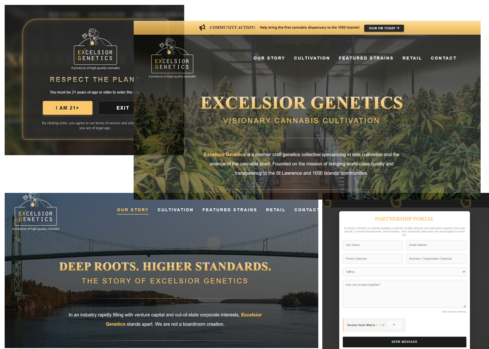

# 🌿 ExGenetics Web Application

The official production web application for **ExGenetics** (dba Northern Legacy), a license-pending cannabis startup in Upstate New York. This platform serves as a high-performance informational hub and lead-generation portal, engineered for regulatory compliance and secure data handling.

**🌐 Live Site:** [exgenetics.com](https://exgenetics.com)

---

## 🚀 Key Commercial Features
* **Compliance Age Gate:** Implements strict NYS-compliant age verification logic (21+). Utilizes **Session Storage** to manage verification state locally, prioritizing user privacy and performance.
* **Dynamic Modular Architecture:** Architected using **EJS (Embedded JavaScript)** to allow for dry, modular components (headers/footers) and dynamic content delivery.
* **Secure SMTP Pipeline:** Custom backend integration with external mail relays for automated partnership inquiries and customer engagement.
* **Mobile-First Design:** Fully responsive UI/UX optimized for high-conversion performance across all device types.

---
## 🛠 Tech Stack
* **Runtime:** Node.js
* **Framework:** Express.js
* **Templating Engine:** EJS
* **Frontend:** HTML5, CSS3, Vanilla JavaScript (ES6+)
* **Security & Env:** Dotenv, SSL/TLS Encryption

---

## 🧪 Quality Assurance & Testing
This project followed a structured QA cycle to ensure the reliability of core business logic and messaging pipelines.

### **Technical QA Case Study**
A detailed breakdown of the testing strategy, functional test cases, and resolved high-severity defects is available:
👉 **[View the Technical QA Case Study](./docs/QA-Case-Study-Partnership-Portal.pdf)**

### **Core Testing Focus:**
* **Data Validation:** Sanitization of server-side inputs to prevent malformed data entry.
* **Integration Testing:** Verification of secure **Port 465/SSL** handshakes between the backend and SMTP relays.
* **Security Hardening:** Implementation of environment-based credential management.
* **Edge Case Verification:** Validation of user flow redirects and error-state messaging logic.

---

## ⚙️ Local Development Setup

### 1. Prerequisites
* **Node.js** (v14 or higher)
* **npm** (Node Package Manager)

### 2. Installation
```bash
git clone (https://github.com/HughMorris01/EXGenetics-Application.git)
cd EXGenetics-Application
npm install
```

### 3. Environment Configuration
Create a `.env` file in the root directory and add the following keys to enable the secure mail relay:

```env
EMAIL_AUTO=your-automated-emailer@example.com
EMAIL_AUTO_PASS=your-automated-emailer-password
EMAIL=your-personal-email@example.com (Receives confirmation from the automated emailer)
```

### 4. Running the App
```bash
npm start
```

---

## 🛠️ Technical Support & Troubleshooting

If you encounter issues during local setup or while using the secure mail relay, please review the following common resolutions:

### **SMTP Connection & Authentication**
* **Error 535 / Authentication Failed:** Ensure you are using a provider-generated **App-Specific Password** rather than your standard account login. Most secure relays (Zoho, Gmail) require this for 2FA-enabled accounts.
* **Connection Timeout / Port 465:** Verify that your local firewall or ISP allows outbound traffic on Port 465. If Port 465 is blocked, ensure you have correctly updated the `Nodemailer` transport settings to utilize `secure: true`.
* **Environment Variables:** Confirm the `.env` file is in the root directory and formatted correctly without spaces around the `=` signs.

### **Session & Age Verification**
* **State Persistence:** If the Age Gate reappears on every page load, verify that **Session Storage** is enabled in your browser. This application does not use persistent cookies for verification to enhance user privacy.
* **Node Versioning:** If dependencies fail to install, ensure you are using **Node v14+**. You can check your version by running `node -v` in your terminal.

---

## 📂 Project Structure
* `/public`: Static assets (CSS, Images, Client-side JS)
* `/views`: EJS templates and modular partials
* `/docs/media/qa`: Technical documentation and QA reports
* `server.js`: Main server configuration and route handling