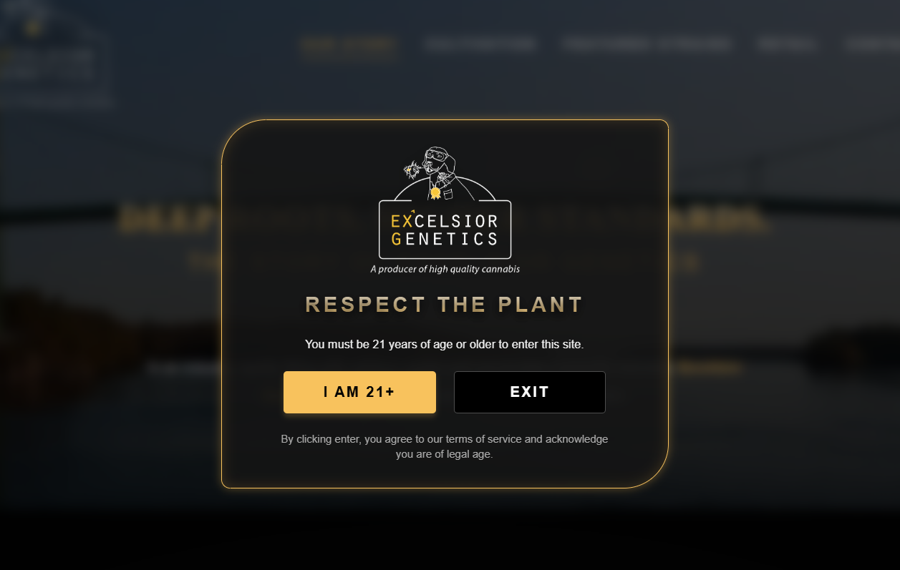
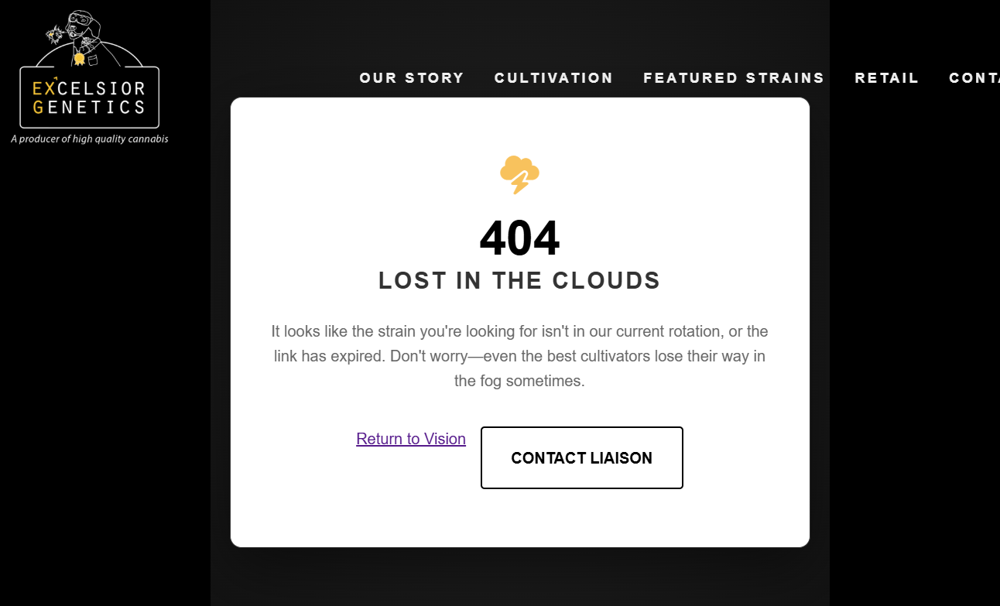
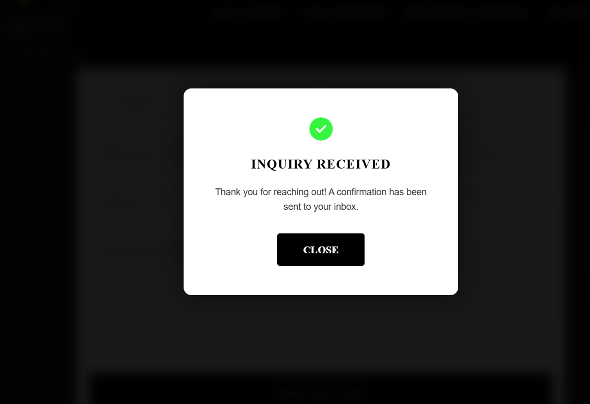
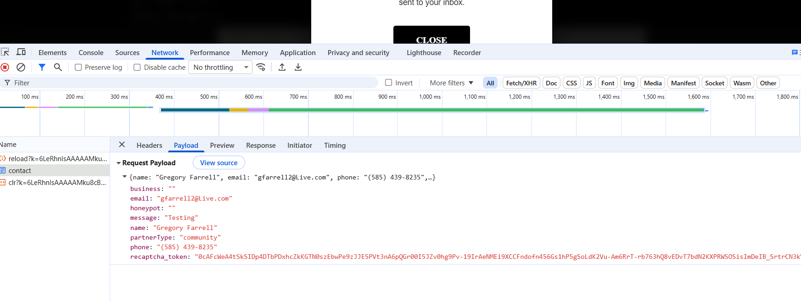
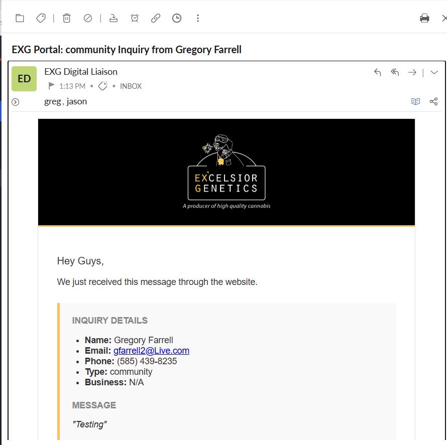
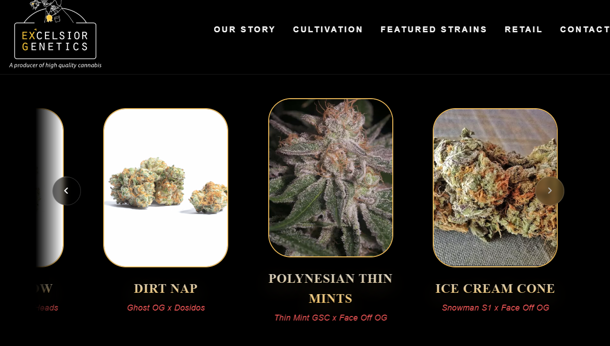
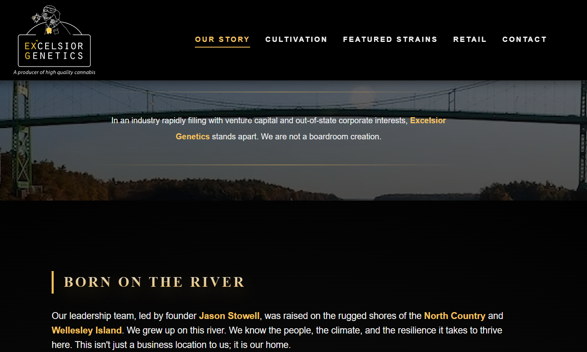

**User Acceptance Testing (UAT) & Quality Assurance Plan**

**Project Name:** Excelsior Genetics Brand Platform

**Developer/Tester:** Greg Farrell

**Date of Testing:** 2026-03-01

**Project Version/Release:** v1.0 - Production Candidate

**1. Testing Environment Checklist**

- **Operating Systems Tested:** Windows 11, Android
- **Browsers Tested:** Chrome, Safari, Firefox
- **Device Viewports:** - Desktop (1920x1080)
  - Mobile (390x844)

**2. Testing Protocol & Evidence**

- **Goal:** Verify that all Functional and Technical requirements outlined in the PRD and TDD have been met.
- **Screenshot Protocol:** Every core functionality test **must** be accompanied by a screenshot proving the expected result. In this Markdown document, embed screenshots directly in the "Proof" column using the syntax: ``.
- **Status Codes:** - **PASS:** Feature works exactly as expected.
  - **FAIL:** Feature is broken or produces an error.
  - **FLAG:** Feature works, but UI/UX feels clunky or needs refinement.

**3. Test Cases**

**Phase 1: Access & Navigation**

| ID  | Feature | Steps to Execute | Expected Result | Pass/Fail | Screenshot Proof | Notes |
| --- | --- | --- | --- | --- | --- | --- |
| **NAV-01** | Age Gate | Load the site in a fresh incognito window. | Age verification overlay appears and blocks scrolling. | [ ] |  | |
| **NAV-02** | Session Storage | Click "I am 21+" and refresh the page. | Overlay fades out; does not reappear on refresh. | [ ] |  | |
| **NAV-03** | 404 Route | Navigate to a non-existent URL (e.g., `/xyz`). | Custom 404 EJS template renders cleanly. | [ ] |  | |

**Phase 2: Core Functionality (Backend Logic)**

| ID  | Feature | Steps to Execute | Expected Result | Pass/Fail | Screenshot Proof | Notes |
| --- | --- | --- | --- | --- | --- | --- |
| **CORE-01** | Petition Scraper | Load any page containing the petition gauge (e.g., `/about`). | Progress bar and signature text display a valid integer fetched from Change.org. | [ ] |  | |
| **CORE-02** | Form Reset | Complete a successful submission. | Success modal appears and form fields automatically clear. | [ ] |  | |

**Phase 3: Security & Integrations**

| ID  | Feature | Steps to Execute | Expected Result | Pass/Fail | Screenshot Proof | Notes |
| --- | --- | --- | --- | --- | --- | --- |
| **SEC-01** | reCAPTCHA v3 | Inspect network tab during form submission. | Valid token is generated and verified by backend. | [ ] |  | |
| **INT-01** | Email Routing | Submit a test inquiry via the form. | Admin (Zoho) receives detailed notification; User receives branded auto-reply. | [ ] |  | |

**Phase 4: UI/UX & Responsiveness**

| ID  | Feature | Steps to Execute | Expected Result | Pass/Fail | Screenshot Proof | Notes |
| --- | --- | --- | --- | --- | --- | --- |
| **UI-01** | Mobile Menu | Open app on a mobile viewport and click the hamburger icon. | Menu expands smoothly, locks body scroll; links work. | [ ] |  | |
| **UI-02** | Header Scroll | Scroll down more than 50px from the top of the page. | Transparent header transitions to a solid black background. | [ ] |  | |
| **UI-03** | Carousel | Click the next/prev arrows on the Strains page. | Genetics carousel scrolls horizontally without breaking layout. | [ ] | | |

**4. Final Sign-Off**

_By signing below, the developer and client agree that all functional requirements have been tested, proven via screenshot evidence, and are approved for production deployment._

**Developer Signature:** _Gregory Farrell_ **Date:** ___3/1/26_____

**Client Signature:** _Jason Stowell_ **Date:** _3/1/26__